# RecruitmentWebPlatform

### Title: « Design and development of an online recruitment platform » {style=text-align:center}
Abstract :
This project consists in creating an online recruitment platform. The goal of our graduation project
is to develop an online recruitment web interface that meets the needs of CERIST. Our application
allows candidates to submit an application, recruiters to manage applications and publish job
postings. To guarantee the completion of the application we have chosen to model with the UML
language, MariaDB is the database server of the application and it has been developed using
different tools such as: Tomcat server, JSP , the JDK, Intellij IDEA ... etc.
The programming language used is Java.
##### Keywords : online recruitment, MVC architecture, JEE, JSP, UML, JAVA.

--- 
### Titre : « Conception et développement d’une plateforme de recrutement en ligne »
Résumé :
Ce projet consiste à réaliser une plateforme de recrutement en ligne . L’objectif de notre projet de
fin d’études est de développer une interface web de recrutement en ligne qui réponde aux besoins
du CERIST. Notre application permet aux candidats de soumettre une candidature, aux recruteurs
de gérer les candidatures et de publier des offres d'emploi. Pour garantir l’achèvement de
l’application nous avons choisi de modéliser avec le langage UML, MariaDB est le serveur de
base de données de l’application et cette dernière a été développée en utilisant différents outils
informatiques tel que : Le serveur Tomcat, JSP, le JDK, Intellij IDEA... etc.
Le langage de programmation utilisé est le Java.
##### Mots clés : recrutement en ligne, architecture MVC, JEE, JSP, UML,JAVA .

## Screenshots :

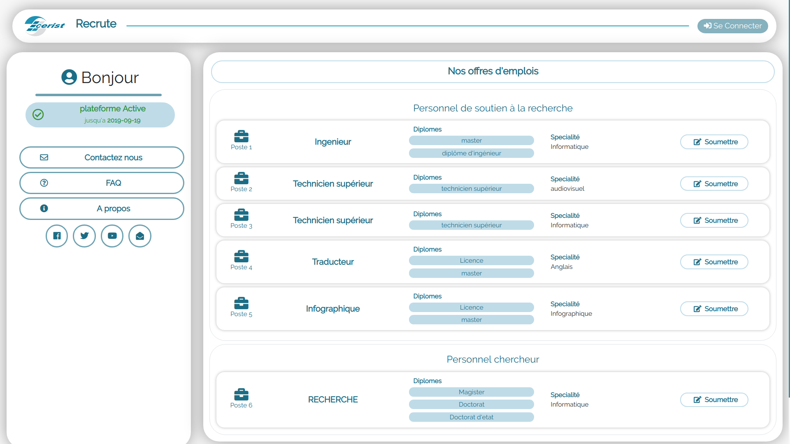
---
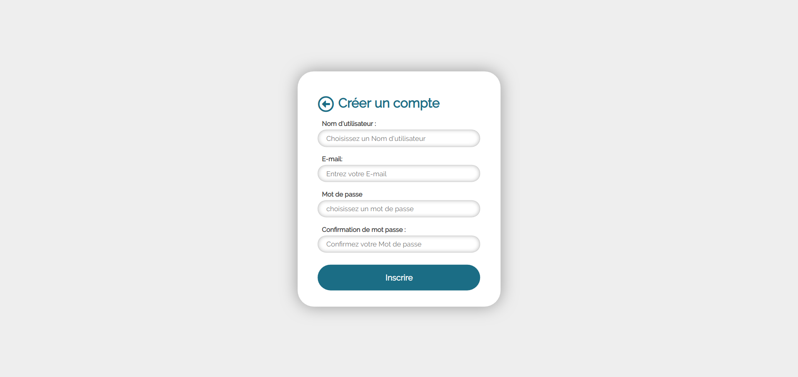
---
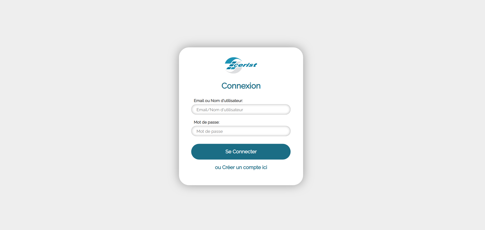
---
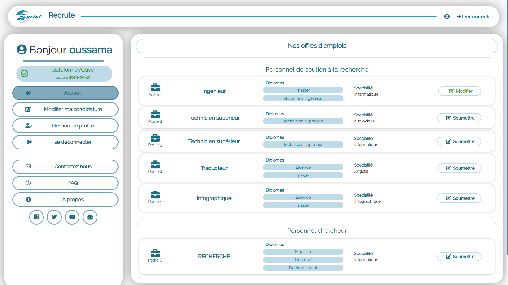
---
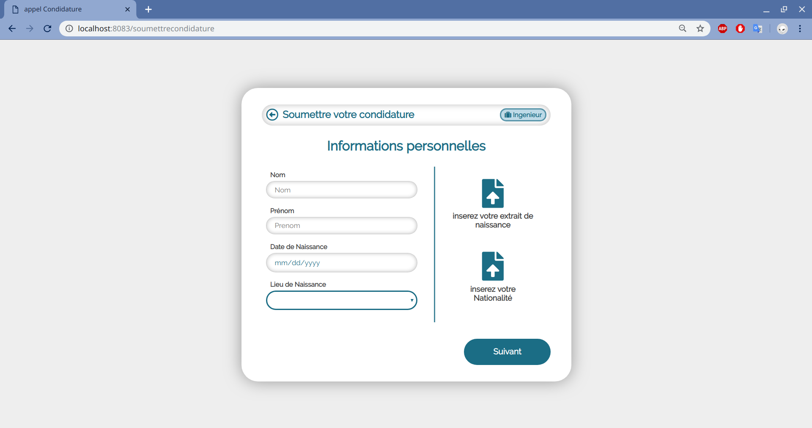
---
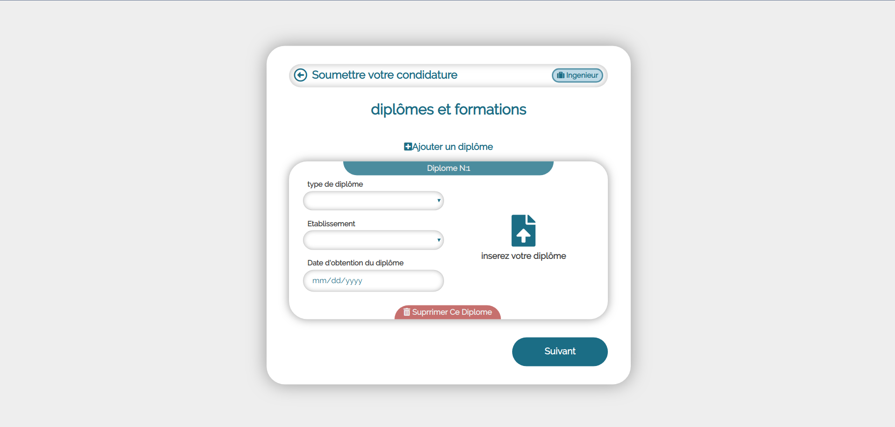
---
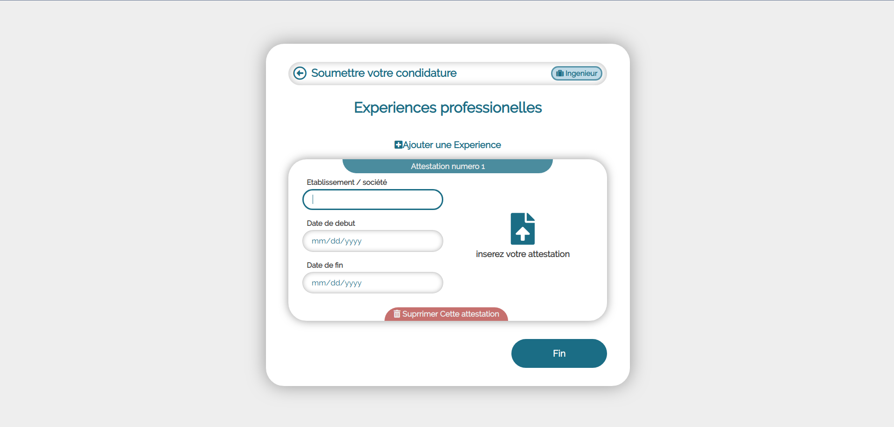
---
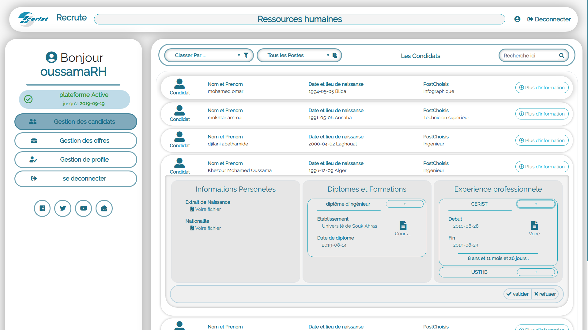
---
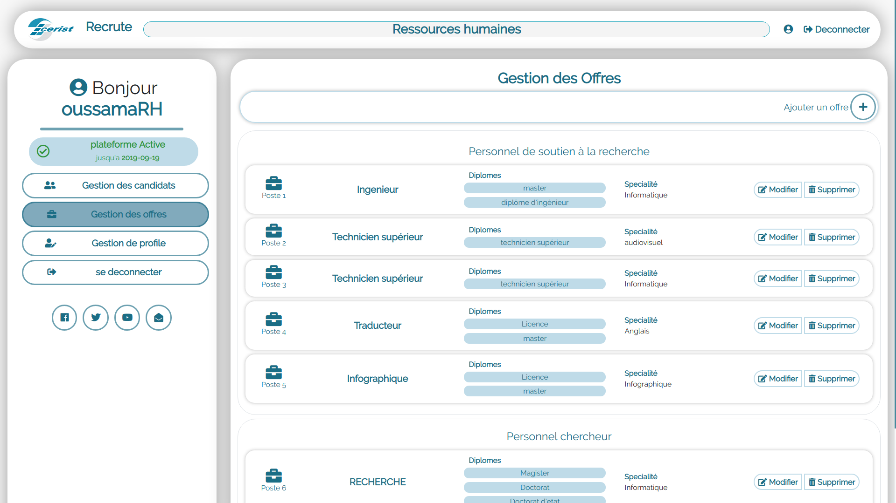
---

---

---
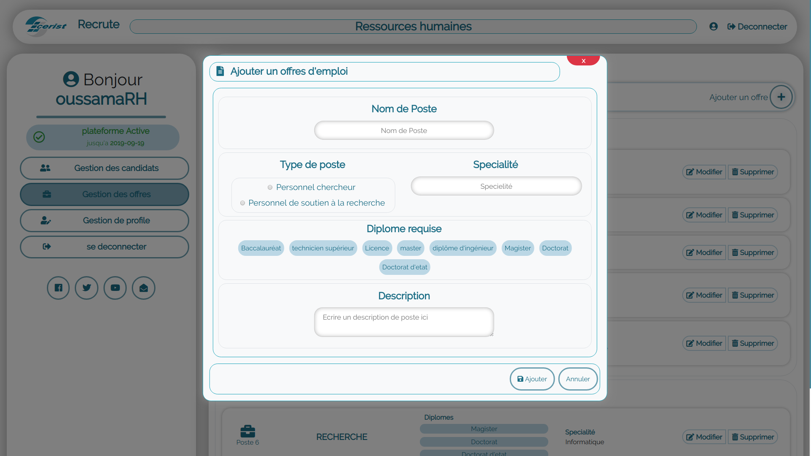
---
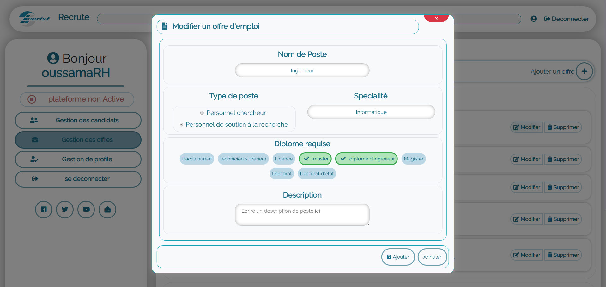
---
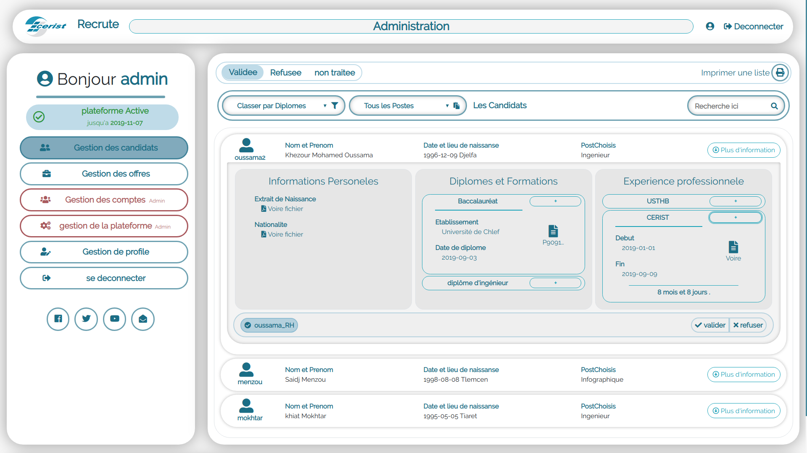
---
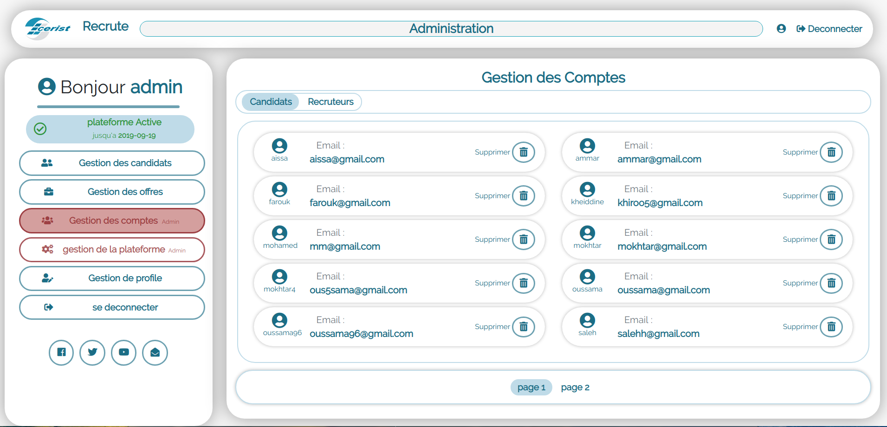
---
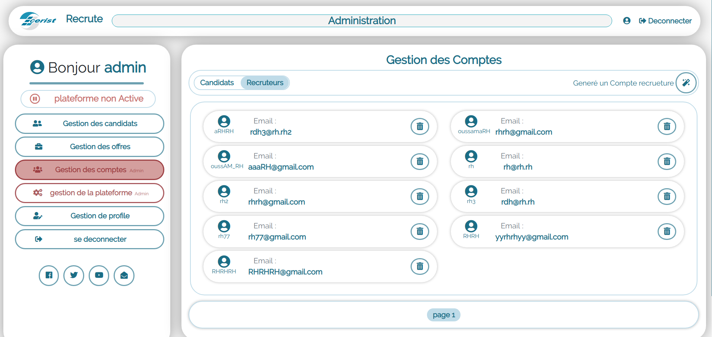
---
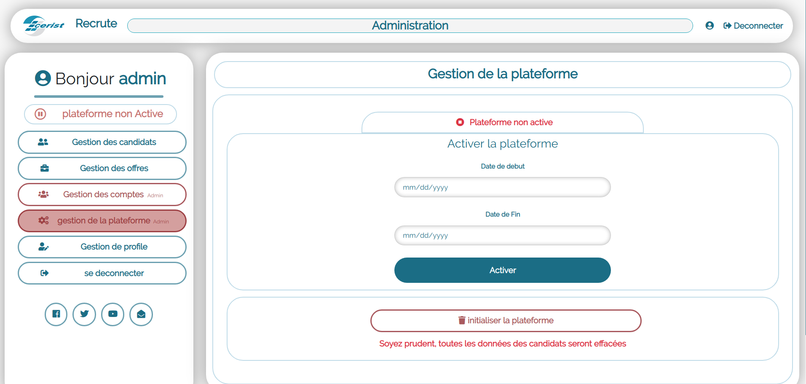
---
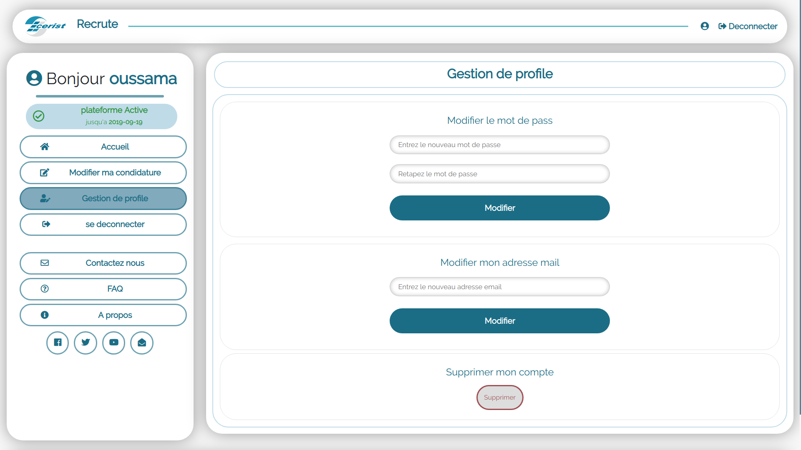
---
